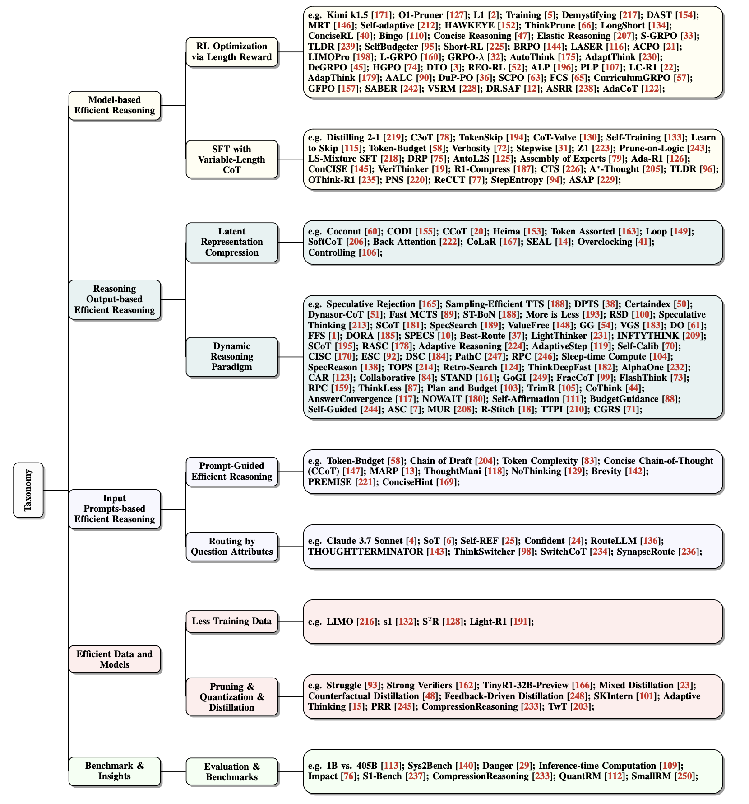

# Awesome-Efficient-Reasoning-LLMs

[](https://arxiv.org/abs/2503.16419)
<!-- []() <!-- Optional: Link to GitHub repo -->
<!-- []() <!-- Fill in your repo link -->
<!-- []() --> 


## [TMLR 2025] Stop Overthinking: A Survey on Efficient Reasoning for Large Language Models

<!-- omit in toc -->

## 📢 Want to add related papers? Feel free to open a pull request!

## 📢 News
- **August 21, 2025**: Updated.
- **July 14, 2025**: "Stop Overthinking" is accepted by TMLR, Transactions on Machine Learning Research.
- **April 22, 2025**: Updated.
- **March 20, 2025**: We release the first survey for efficient reasoning of LLMs "[Stop Overthinking: A Survey on Efficient Reasoning for Large Language Models](https://arxiv.org/abs/2503.16419)".  
  Feel free to cite, contribute, or open a pull request to add recent related papers!
  

<!-- omit in toc -->


In this paper, we present the first structured survey that systematically investigates and organizes the current progress in achieving **efficient reasoning in LLMs**.

## 📊 Taxonomy

Below is a taxonomy graph summarizing the current landscape of efficient reasoning research for LLMs:



---

<!-- omit in toc -->
## 📚 Table of Contents

- [Awesome-Efficient-Reasoning-LLM](#awesome-efficient-reasoning-llm)
  - **Model-based Efficient Reasoning**
    - [Section I: RL with Length Reward Design](#section-i-rl-with-length-reward-design)
    - [Section II: SFT with Variable-Length CoT Data](#section-ii-sft-with-variable-length-cot-data)
  - **Reasoning Output-based Efficient Reasoning**
    - [Section III: Compressing Reasoning Steps into Fewer Latent Representation](#section-iii-compressing-reasoning-steps-into-fewer-latent-representation)
    - [Section IV: Dynamic Reasoning Paradigm during Inference](#section-iv-dynamic-reasoning-paradigm-during-inference)
  - **Input Prompt-based Efficient Reasoning**
    - [Section V: Prompt-Guided Efficient Reasoning](#section-v-prompt-guided-efficient-reasoning)
    - [Section VI: Prompts Attribute-Driven Reasoning Routing](#section-vi-prompts-attribute-driven-reasoning-routing)
  - **Reasoning Abilities with Efficient Data and Small Language Models**
    - [Section VII: Reasoning Abilities via Efficient Training Data and Model Compression](#section-vii-reasoning-abilities-via-efficient-training-data-and-model-compression)
  - **Evaluation and Benchmark**
    - [Section VIII: Evaluation and Benchmark](#section-viii-evaluation-and-benchmark)


---

<!--[[Paper]](pdf LINK) -->

"(.)" stands for "To Be Updated" in the survey paper.

## Section I:  RL with Length Reward Design

* Demystifying Long Chain-of-Thought Reasoning in LLMs [[Paper]](https://arxiv.org/pdf/2502.03373) 
* O1-Pruner: Length-Harmonizing Fine-Tuning for O1-Like Reasoning Pruning [[Paper]](https://arxiv.org/pdf/2501.12570) 
* Kimi k1.5: Scaling Reinforcement Learning with LLMs [[Paper]](https://arxiv.org/pdf/2501.12599) 
* Training Language Models to Reason Efficiently [[Paper]](https://arxiv.org/pdf/2502.04463) 
* L1: Controlling How Long A Reasoning Model Thinks With Reinforcement Learning [[Paper]](https://www.arxiv.org/pdf/2503.04697) 
* DAST: Difficulty-Adaptive Slow-Thinking for Large Reasoning Models [[Paper]](https://arxiv.org/pdf/2503.04472) 
* Optimizing Test-Time Compute via Meta Reinforcement Fine-Tuning [[Paper]](https://arxiv.org/pdf/2503.07572) 
* HAWKEYE: Efficient Reasoning with Model Collaboration [[Paper]](https://arxiv.org/pdf/2504.00424) 
* THINKPRUNE: Pruning Long Chain-of-Thought of LLMs via Reinforcement Learning [[Paper]](https://arxiv.org/pdf/2504.01296) 
* Think When You Need: Self-Adaptive Chain-of-Thought Learning [[Paper]](https://arxiv.org/pdf/2504.03234) 
* Concise Reasoning via Reinforcement Learning [[Paper]](https://arxiv.org/pdf/2504.05185) 
* Not All Thoughts are Generated Equal: Efficient LLM Reasoning via Multi-Turn Reinforcement Learning [[Paper]](https://arxiv.org/pdf/2505.11827) 
* ConciseRL: Conciseness-Guided Reinforcement Learning for Efficient Reasoning Models [[Paper]](https://arxiv.org/pdf/2505.17250) 
* Scalable Chain of Thoughts via Elastic Reasoning [[Paper]](https://arxiv.org/pdf/2505.05315) 
* S-GRPO: Early Exit via Reinforcement Learning in Reasoning Models [[Paper]](https://arxiv.org/pdf/2505.07686) 
* SelfBudgeter: Adaptive Token Allocation for Efficient LLM Reasoning [[Paper]](https://arxiv.org/pdf/2505.11274) 
* Making Small Language Models Efficient Reasoners: Intervention, Supervision, Reinforcement [[Paper]](https://arxiv.org/pdf/2505.07961) 
* Efficient RL Training for Reasoning Models via Length-Aware Optimization [[Paper]](https://arxiv.org/pdf/2505.12284) 
* Optimizing Anytime Reasoning via Budget Relative Policy Optimization [[Paper]](https://arxiv.org/pdf/2505.13438) 
* Learn to Reason Efficiently with Adaptive Length-based Reward Shaping [[Paper]](https://arxiv.org/pdf/2505.15612) 
* Incentivizing Dual Process Thinking for Efficient Large Language Model Reasoning [[Paper]](https://arxiv.org/pdf/2505.16315) 
* LIMOPro: Reasoning Refinement for Efficient and Effective Test-time Scaling [[Paper]](https://arxiv.org/pdf/2505.19187) 
* Walk Before You Run! Concise LLM Reasoning via Reinforcement Learning [[Paper]](https://arxiv.org/pdf/2505.21178) 
* Stable Reinforcement Learning for Efficient Reasoning [[Paper]](https://arxiv.org/pdf/2505.18086) 
* Don't Think Longer, Think Wisely: Optimizing Thinking Dynamics for Large Reasoning Models [[Paper]](https://arxiv.org/pdf/2505.21765) 
* Thinkless: LLM Learns When to Think. [[Paper]](https://arxiv.org/pdf/2505.13379) 
* Think Only When You Need with Large Hybrid-Reasoning Models. [[Paper]](https://arxiv.org/pdf/2505.14631) 
* When to Continue Thinking: Adaptive Thinking Mode Switching for Efficient Reasoning. [[Paper]](https://arxiv.org/pdf/2505.15400) 
* AdaCoT: Pareto-Optimal Adaptive Chain-of-Thought Triggering via Reinforcement Learning. [[Paper]](https://arxiv.org/pdf/2505.11896) 
* Learning When to Think: Shaping Adaptive Reasoning in R1-Style Models via Multi-Stage RL. [[Paper]](https://arxiv.org/pdf/2505.10832) 
* AdaptThink: Reasoning Models Can Learn When to Think. [[Paper]](https://arxiv.org/pdf/2505.13417) 
* Bingo: Boosting Efficient Reasoning of LLMs via Dynamic and Significance-based Reinforcement Learning [[Paper]](https://arxiv.org/pdf/2506.08125) 
* How Far Are We from Optimal Reasoning Efficiency? [[Paper]](https://arxiv.org/pdf/2506.07104) 
* Just Enough Thinking: Efficient Reasoning with Adaptive Length Penalties Reinforcement Learning. [[Paper]](https://arxiv.org/abs/2506.05256) 
* Fast on the Easy, Deep on the Hard: Efficient Reasoning via Powered Length Penalty. [[Paper]](https://arxiv.org/abs/2506.10446) 
* Optimizing Length Compression in Large Reasoning Models. [[Paper]](https://arxiv.org/abs/2506.14755) 
* AdapThink: Adaptive Thinking Preferences for Reasoning Language Model. [[Paper]](https://arxiv.org/abs/2506.18237) 
* AALC: Large Language Model Efficient Reasoning via Adaptive Accuracy-Length Control. [[Paper]](https://arxiv.org/abs/2506.20160) 
* Do Thinking Tokens Help or Trap? Towards More Efficient Large Reasoning Model. [[Paper]](https://arxiv.org/abs/2506.23840) 
* SmartThinker: Learning to Compress and Preserve Reasoning by Step-Level Length Control. [[Paper]](https://arxiv.org/abs/2507.04348) 
* Reconsidering Overthinking: Penalizing Internal and External Redundancy in CoT Reasoning. [[Paper]](https://arxiv.org/abs/2508.02178) 
* Train Long, Think Short: Curriculum Learning for Efficient Reasoning. [[Paper]](https://arxiv.org/abs/2508.08940) 
* Sample More to Think Less: Group Filtered Policy Optimization for Concise Reasoning. [[Paper]](https://arxiv.org/abs/2508.09726) 
* SABER: Switchable and Balanced Training for Efficient LLM Reasoning.  [[Paper]](https://arxiv.org/abs/2508.10026) 
* Promoting Efficient Reasoning with Verifiable Stepwise Reward. [[Paper]](https://arxiv.org/abs/2508.10293) 
* Aware First, Think Less: Dynamic Boundary Self-Awareness Drives Extreme Reasoning Efficiency in Large Language Models. [[Paper]](https://arxiv.org/abs/2508.11582) 


## Section II: SFT with Variable-Length CoT Data

* TokenSkip: Controllable Chain-of-Thought Compression in LLMs [[Paper]](https://arxiv.org/pdf/2502.12067) 
* C3oT: Generating Shorter Chain-of-Thought without Compromising Effectiveness [[Paper]](https://arxiv.org/pdf/2412.11664) 
* CoT-Valve: Length-Compressible Chain-of-Thought Tuning [[Paper]](https://arxiv.org/pdf/2502.09601) 
* Self-Training Elicits Concise Reasoning in Large Language Models [[Paper]](https://arxiv.org/pdf/2502.20122) 
* Distilling System 2 into System 1 [[Paper]](https://arxiv.org/pdf/2407.06023) 
* Can Language Models Learn to Skip Steps? [[Paper]](https://arxiv.org/pdf/2411.01855) 
* Verbosity-Aware Rationale Reduction: Sentence-Level Rationale Reduction for Efficient and Effective Reasoning. [[Paper]](https://arxiv.org/pdf/2412.21006) 
* Stepwise Perplexity-Guided Refinement for Efficient Chain-of-Thought Reasoning in Large Language Models [[Paper]](https://arxiv.org/pdf/2502.13260) 
* Z1: Efficient Test-time Scaling with Code [[Paper]](https://arxiv.org/pdf/2504.00810) 
* Ada-R1: Hybrid-CoT via Bi-Level Adaptive Reasoning Optimization [[Paper]](https://arxiv.org/pdf/2504.21659) 
* Long-Short Chain-of-Thought Mixture Supervised Fine-Tuning Eliciting Efficient Reasoning in Large Language Models [[Paper]](https://arxiv.org/pdf/2505.03469) 
* DRP: Distilled Reasoning Pruning with Skill-aware Step Decomposition for Efficient Large Reasoning Models [[Paper]](https://arxiv.org/pdf/2505.13975) 
* AutoL2S: Auto Long-Short Reasoning for Efficient Large Language Models [[Paper]](https://arxiv.org/pdf/2505.22662) 
* Can Pruning Improve Reasoning? Revisiting Long-CoT Compression with Capability in Mind for Better Reasoning [[Paper]](https://arxiv.org/abs/2505.14582) 
* VeriThinker: Learning to Verify Makes Reasoning Model Efficient [[Paper]](https://arxiv.org/abs/2505.17941) 
* Assembly of Experts: Linear-time construction of the Chimera LLM variants with emergent and adaptable behaviors [[Paper]](https://arxiv.org/pdf/2506.14794) [[Model Card]](https://huggingface.co/tngtech/DeepSeek-TNG-R1T2-Chimera) [[Free access via OpenRouter]](https://openrouter.ai/tngtech/deepseek-r1t2-chimera:free) 
* R1-Compress: Long Chain-of-Thought Compression via Chunk Compression and Search [[Paper]](https://arxiv.org/abs/2505.16838) 
* Not All Tokens Are What You Need In Thinking [[Paper]](https://arxiv.org/abs/2505.17827) 
* A*-Thought: Efficient Reasoning via Bidirectional Compression for Low-Resource Settings [[Paper]](https://arxiv.org/abs/2505.24550) 
* ConCISE: Confidence-guided Compression in Step-by-step Efficient Reasoning [[Paper]](https://arxiv.org/abs/2505.04881) 
* TL;DR: Too Long, Do Re-weighting for Efficient LLM Reasoning Compression [[Paper]](https://arxiv.org/abs/2506.02678) 
* OThink-R1: Intrinsic Fast/Slow Thinking Mode Switching for Over-Reasoning Mitigation. [[Paper]](https://arxiv.org/pdf/2506.02397) 
* Causal Sufficiency and Necessity Improves Chain-of-Thought Reasoning [[Paper]](https://arxiv.org/abs/2506.09853) 
* ReCUT: Balancing Reasoning Length and Accuracy in LLMs via Stepwise Trails and Preference Optimization. [[Paper]](https://arxiv.org/abs/2506.10822) 
* Compressing Chain-of-Thought in LLMs via Step Entropy. [[Paper]](https://arxiv.org/pdf/2508.03346) 
* Pruning the Unsurprising: Efficient Code Reasoning via First-Token Surprisal. [[Paper]](https://arxiv.org/pdf/2508.05988) 

  
## Section III: Compressing Reasoning Steps into Fewer Latent Representation

* Training Large Language Models to Reason in a Continuous Latent Space [[Paper]](https://arxiv.org/pdf/2412.06769) 
* Compressed Chain of Thought: Efficient Reasoning through Dense Representations [[Paper]](https://arxiv.org/pdf/2412.13171) 
* Efficient Reasoning with Hidden Thinking (MLLM) [[Paper]](https://arxiv.org/pdf/2501.19201) 
* SoftCoT: Soft Chain-of-Thought for Efficient Reasoning with LLMs [[Paper]](https://arxiv.org/pdf/2502.12134) 
* Token Assorted: Mixing Latent and Text Tokens for Improved Language Model Reasoning [[Paper]](https://arxiv.org/pdf/2502.03275) 
* Reasoning with Latent Thoughts: On the Power of Looped Transformers [[Paper]](https://arxiv.org/pdf/2502.17416) 
* CODI: Compressing Chain-of-Thought into Continuous Space via Self-Distillation [[Paper]](https://arxiv.org/pdf/2502.21074) 
* Efficient Reasoning with Hidden Thinking [[Paper]](https://arxiv.org/pdf/2501.19201) 
* Token Assorted: Mixing Latent and Text Tokens for Improved Language Model Reasoning [[Paper]](https://arxiv.org/pdf/2502.03275) 
* Back Attention: Understanding and Enhancing Multi-Hop Reasoning in Large Language Models [[Paper]](https://arxiv.org/pdf/2502.10835) 
* SEAL: Steerable Reasoning Calibration of Large Language Models for Free [[Paper]](https://arxiv.org/pdf/2504.07986) 
* Think Silently, Think Fast: Dynamic Latent Compression of LLM Reasoning Chains [[Paper]](https://arxiv.org/pdf/2505.16552) 
* Overclocking LLM Reasoning: Monitoring and Controlling Thinking Path Lengths in LLMs [[Paper]](https://arxiv.org/pdf/2506.07240) 
* Controlling Thinking Speed in Reasoning Models. [[Paper]](https://arxiv.org/pdf/2507.03704) 

## Section IV: Dynamic Reasoning Paradigm during Inference

* Efficiently Serving LLM Reasoning Programs with Certaindex [[Paper]](https://arxiv.org/pdf/2412.20993) 
* When More is Less: Understanding Chain-of-Thought Length in LLMs [[Paper]](https://arxiv.org/pdf/2502.07266) 
* Sketch-of-Thought: Efficient LLM Reasoning with Adaptive Cognitive-Inspired Sketching [[Paper]](https://arxiv.org/pdf/2503.05179) 
* Reward-Guided Speculative Decoding for Efficient LLM Reasoning [[Paper]](https://arxiv.org/pdf/2501.19324) 
* Fast Best-of-N Decoding via Speculative Rejection [[Paper]](https://arxiv.org/pdf/2410.20290) 
* FastMCTS: A Simple Sampling Strategy for Data Synthesis [[Paper]](https://www.arxiv.org/pdf/2502.11476) 
* Dynamic Parallel Tree Search for Efficient LLM Reasoning [[Paper]](https://arxiv.org/pdf/2502.16235) 
* Sampling-Efficient Test-Time Scaling: Self-Estimating the Best-of-N Sampling in Early Decoding [[Paper]](https://arxiv.org/pdf/2503.01422) 
* LightThinker: Thinking Step-by-Step Compression (training LLMs to compress thoughts into gist tokens) [[Paper]](https://arxiv.org/pdf/2502.15589) 
* InftyThink: Breaking the Length Limits of Long-Context Reasoning in Large Language Models [[Paper]](https://www.arxiv.org/pdf/2503.06692) 
* Reasoning Without Self-Doubt: More Efficient Chain-of-Thought Through Certainty Probing [[Paper]](https://openreview.net/pdf?id=wpK4IMJfdX) 
* SpecReason: Fast and Accurate Inference-Time Compute via Speculative Reasoning [[Paper]](https://arxiv.org/abs/2504.07891) 
* AdaptiveStep: Automatically Dividing Reasoning Step through Model Confidence [[Paper]](https://arxiv.org/pdf/2502.13943) 
* Speculative Thinking: Enhancing Small-Model Reasoning with Large Model Guidance at Inference Time [[Paper]](https://arxiv.org/pdf/2504.12329) 
* Efficient Reasoning for LLMs through Speculative Chain-of-Thought. [[Paper]](https://arxiv.org/pdf/2504.19095) 
* Can atomic step decomposition enhance the self-structured reasoning of multimodal large models? [[Paper]](https://arxiv.org/pdf/2503.06252) 
* Think smarter not harder: Adaptive reasoning with inference aware optimization [[Paper]](https://arxiv.org/pdf/2501.17974) 
* Reasoning Aware Self-Consistency: Leveraging Reasoning Paths for Efficient LLM Sampling [[Paper]](https://arxiv.org/pdf/2408.17017) 
* Escape Sky-high Cost: Early-stopping Self-Consistency for Multi-step Reasoning [[Paper]](https://arxiv.org/pdf/2401.10480) 
* Confidence Improves Self-Consistency in LLMs [[Paper]](https://arxiv.org/pdf/2502.06233) 
* Make every penny count: Difficulty-adaptive self-consistency for cost-efficient reasoning [[Paper]](https://arxiv.org/pdf/2408.13457) 
* Path-consistency: Prefix enhancement for efficient inference in llm [[Paper]](https://arxiv.org/pdf/2409.01281) 
* Bridging internal probability and self-consistency for effective and efficient llm reasoning [[Paper]](https://arxiv.org/pdf/2502.00511) 
* Towards thinking-optimal scaling of test-time compute for llm reasoning [[Paper]](https://arxiv.org/pdf/2502.18080) 
* Think Deep, Think Fast: Investigating Efficiency of Verifier-free Inference-time-scaling Methods[[Paper]](https://arxiv.org/pdf/2504.14047) 
* Reasoning models can be effective without thinking [[Paper]](https://arxiv.org/pdf/2504.09858) 
* Retro-search: Exploring untaken paths for deeper and efficient reasoning [[Paper]](https://arxiv.org/pdf/2504.04383) 
* Thought manipulation: External thought can be efficient for large reasoning models [[Paper]](https://arxiv.org/pdf/2504.13626) 
* Sleep-time compute: Beyond inference scaling at test-time [[Paper]](https://arxiv.org/pdf/2504.13171) 
* Unlocking the capabilities of thought: A reasoning boundary framework to quantify and optimize chain-of-thought [[Paper]](https://arxiv.org/pdf/2410.05695) 
* THOUGHTTERMINATOR: Benchmarking, Calibrating, and Mitigating Overthinking in Reasoning Models [[Paper]](https://arxiv.org/pdf/2504.13367) 
* Dynamic Early Exit in Reasoning Models [[Paper]](https://arxiv.org/pdf/2504.15895) 
* AlphaOne: Reasoning Models Thinking Slow and Fast at Test Time [[Paper]](https://arxiv.org/pdf/2505.24863) 
* Putting the Value Back in RL: Better Test-Time Scaling by Unifying LLM Reasoners With Verifiers. [[Paper]](https://arxiv.org/pdf/2505.04842) 
* Guided by Gut: Efficient Test-Time Scaling with Reinforced Intrinsic Confidence. [[Paper]](https://arxiv.org/pdf/2505.20325) 
* Fractured Chain-of-Thought Reasoning [[Paper]](https://arxiv.org/pdf/2505.12992) 
* Value-Guided Search for Efficient Chain-of-Thought Reasoning. [[Paper]](https://arxiv.org/pdf/2505.17373) 
* Don't Overthink it. Preferring Shorter Thinking Chains for Improved LLM Reasoning. [[Paper]](https://arxiv.org/pdf/2505.17813) 
* First Finish Search: Efficient Test-Time Scaling in Large Language Models [[Paper]](https://arxiv.org/pdf/2505.18149) 
* Accelerating Large Language Model Reasoning via Speculative Search. [[Paper]](https://arxiv.org/pdf/2505.02865) 
* FlashThink: An Early Exit Method For Efficient Reasoning [[Paper]](https://arxiv.org/abs/2505.13949) 
* Reasoning Path Compression: Compressing Generation Trajectories for Efficient LLM Reasoning [[Paper]](https://arxiv.org/abs/2505.13866) 
* Accelerating Chain-of-Thought Reasoning: When Goal-Gradient Importance Meets Dynamic Skipping [[Paper]](https://arxiv.org/abs/2505.08392) 
* ThinkLess: A Training-Free Inference-Efficient Method for Reducing Reasoning Redundancy [[Paper]](https://arxiv.org/abs/2505.15684) 
* Plan and Budget: Effective and Efficient Test-Time Scaling on Large Language Model Reasoning [[Paper]](https://arxiv.org/abs/2505.16122) 
* TrimR: Verifier-based Training-Free Thinking Compression for Efficient Test-Time Scaling [[Paper]](https://arxiv.org/abs/2505.17155) 
* CoThink: Token-Efficient Reasoning via Instruct Models Guiding Reasoning Models [[Paper]](https://arxiv.org/abs/2505.22017) 
* Prolonged Reasoning Is Not All You Need: Certainty-Based Adaptive Routing for Efficient LLM/MLLM Reasoning. [[Paper]](https://arxiv.org/abs/2505.15154) 
* AlphaOne: Reasoning Models Thinking Slow and Fast at Test Time. [[Paper]](https://arxiv.org/abs/2505.24863) 
* Every Rollout Counts: Optimal Resource Allocation for Efficient Test-Time Scaling. [[Paper]](https://arxiv.org/pdf/2506.15707) 
* SPECS: Faster Test-Time Scaling through Speculative Drafts. [[Paper]](https://arxiv.org/pdf/2506.15733) 
* BEST-Route: Adaptive LLM Routing with Test-Time Optimal Compute. [[Paper]](https://arxiv.org/pdf/2506.22716) 
* Accelerated Test-Time Scaling with Model-Free Speculative Sampling [[Paper]](https://arxiv.org/abs/2506.04708) 
* Answer Convergence as a Signal for Early Stopping in Reasoning [[Paper]](https://arxiv.org/abs/2506.02536) 
* Collaborative LLM Inference via Planning for Efficient Reasoning. [[Paper]](https://arxiv.org/abs/2506.11578) 
* Wait, We Don't Need to "Wait"! Removing Thinking Tokens Improves Reasoning Efficiency [[Paper]](https://arxiv.org/abs/2506.08343) 
* Efficient Reasoning Through Suppression of Self-Affirmation Reflections in Large Reasoning Models. [[Paper]](https://arxiv.org/abs/2506.12353) 
* Steering LLM Thinking with Budget Guidance. [[Paper]](https://arxiv.org/abs/2506.13752) 
* Exploring and Exploiting the Inherent Efficiency within Large Reasoning Models for Self-Guided Efficiency Enhancement. [[Paper]](https://arxiv.org/abs/2506.15647) 
* Activation Steering for Chain-of-Thought Compression. [[Paper]](https://arxiv.org/abs/2507.04742) 
* R-Stitch: Dynamic Trajectory Stitching for Efficient Reasoning. [[Paper]](https://arxiv.org/abs/2507.17307) 
* MUR: Momentum Uncertainty guided Reasoning for Large Language Models. [[Paper]](https://arxiv.org/abs/2507.14958) 
* Test-time Prompt Intervention. [[Paper]](https://arxiv.org/abs/2508.02511) 
* Efficient Reasoning for Large Reasoning Language Models via Certainty-Guided Reflection Suppression. [[Paper]](https://arxiv.org/abs/2508.05337) 


## Section V: Prompt-Guided Efficient Reasoning

* Token-Budget-Aware LLM Reasoning [[Paper]](https://arxiv.org/pdf/2412.18547) 
* Chain of Draft: Thinking Faster by Writing Less [[Paper]](https://arxiv.org/pdf/2502.18600) 
* How Well do LLMs Compress Their Own Chain-of-Thought? A Token Complexity Approach [[Paper]](https://arxiv.org/pdf/2503.01141) 
* The Benefits of a Concise Chain of Thought on Problem-Solving in Large Language Models [[Paper]](https://arxiv.org/pdf/2401.05618) 
* Brevity is the soul of sustainability: Characterizing LLM response lengths. [[Paper]](https://arxiv.org/pdf/2506.08686) 
* PREMISE: Scalable and Strategic Prompt Optimization for Efficient Mathematical Reasoning in Large Models. [[Paper]](https://arxiv.org/pdf/2506.10716) 
* ConciseHint: Boosting Efficient Reasoning via Continuous Concise Hints during Generation. [[Paper]](https://arxiv.org/pdf/2506.18810) 

## Section VI: Prompts Attribute-Driven Reasoning Routing
* Claude 3.7 Sonnet and Claude Code [[website]](https://www.anthropic.com/news/claude-3-7-sonnet) 
* Sketch-of-Thought: Efficient LLM Reasoning with Adaptive Cognitive-Inspired Sketching [[Paper]](https://arxiv.org/pdf/2503.05179) 
* Learning to Route LLMs with Confidence Tokens [[Paper]](https://arxiv.org/pdf/2410.13284) 
* Confident or Seek Stronger: Exploring Uncertainty-Based On-device LLM Routing From Benchmarking to Generalization [[Paper]](https://arxiv.org/pdf/2502.04428) 
* RouteLLM: Learning to Route LLMs with Preference Data [[Paper]](https://arxiv.org/pdf/2406.18665) 
* ThinkSwitcher: When to Think Hard, When to Think Fast. [[Paper]](https://arxiv.org/pdf/2505.14183) 
* Long or short CoT? Investigating Instance-level Switch of Large Reasoning Models. [[Paper]](https://arxiv.org/pdf/2506.04182) 
* SynapseRoute: An Auto-Route Switching Framework on Dual-State Large Language Model. [[Paper]](https://arxiv.org/pdf/2507.02822) 

## Section VII: Reasoning Abilities via Efficient Training Data and Model Compression

* LIMO: Less is More for Reasoning [[Paper]](https://arxiv.org/pdf/2502.03387) 
* s1: Simple test-time scaling [[Paper]](https://arxiv.org/pdf/2501.19393) 
* S2R: Teaching LLMs to Self-verify and Self-correct via Reinforcement Learning [[Paper]](https://arxiv.org/pdf/2502.12853) 
* Light-R1: Curriculum SFT, DPO and RL for Long COT from Scratch and Beyond [[Paper]](https://arxiv.org/pdf/2503.10460) 
* Small Models Struggle to Learn from Strong Reasoners [[Paper]](https://arxiv.org/pdf/2502.12143) 
* Towards Reasoning Ability of Small Language Models [[Paper]](https://arxiv.org/pdf/2502.11569) 
* Mixed Distillation Helps Smaller Language Models Reason Better [[Paper]](https://arxiv.org/pdf/2312.10730) 
* Small language models need strong verifiers to self-correct reasoning [[Paper]](https://arxiv.org/pdf/2404.17140) 
* Teaching Small Language Models Reasoning through Counterfactual Distillation [[Paper]](https://aclanthology.org/2024.emnlp-main.333.pdf) 
* Improving Mathematical Reasoning Capabilities of Small Language Models via Feedback-Driven Distillation [[Paper]](https://arxiv.org/pdf/2411.14698) 
* Probe then retrieve and reason: Distilling probing and reasoning capabilities into smaller language models [[Paper]](https://aclanthology.org/2024.lrec-main.1140.pdf) 
* Distilling Reasoning Ability from Large Language Models with Adaptive Thinking [[Paper]](https://arxiv.org/pdf/2404.09170) 
* SKIntern: Internalizing Symbolic Knowledge for Distilling Better CoT Capabilities into Small Language Models [[Paper]](https://arxiv.org/pdf/2409.13183) 
* TinyR1-32B-Preview: Boosting Accuracy with Branch-Merge Distillation [[Paper]](https://arxiv.org/pdf/2503.04872) 
* Improving mathematical reasoning capabilities of small language models via feedback-driven distillation [[Paper]](https://arxiv.org/pdf/2411.14698) 
* Probe then retrieve and reason: Distilling probing and reasoning capabilities into smaller language models [[Paper]](https://arxiv.org/pdf/2212.00193) 
* TwT: Thinking without Tokens by Habitual Reasoning Distillation with Multi-Teachers’ Guidance [[Paper]](https://arxiv.org/pdf/2503.24198) 
* When Reasoning Meets Compression: Benchmarking Compressed Large Reasoning Models on Complex Reasoning Tasks [[Paper]](https://arxiv.org/pdf/2504.02010) 


## Section VIII: Evaluation and Benchmark
* Can 1B LLM Surpass 405B LLM? Rethinking Compute-Optimal Test-Time Scaling [[Paper]](https://arxiv.org/pdf/2502.06703) 
* The Danger of Overthinking: Examining the Reasoning-Action Dilemma in Agentic Tasks [[Paper]](https://arxiv.org/pdf/2502.08235) 
* Inference-Time Computations for LLM Reasoning and Planning: A Benchmark and Insights [[Paper]](https://arxiv.org/pdf/2502.12521) 
* Bag of Tricks: Benchmarking of Jailbreak Attacks on LLMs [[Paper]](https://arxiv.org/pdf/2406.09324) 
* The Impact of Reasoning Step Length on Large Language Models [[Paper]](https://arxiv.org/html/2401.04925v3) 
* S1-bench: A simple benchmark for evaluating system 1 thinking capability of large reasoning models [[Paper]](https://arxiv.org/pdf/2504.10368) 
* When reasoning meets compression: Benchmarking compressed large reasoning models on complex reasoning tasks. [[Paper]](https://arxiv.org/pdf/2504.02010) 
* Quantization Hurts Reasoning? An Empirical Study on Quantized Reasoning Models [[Paper]](https://arxiv.org/pdf/2504.04823) 
* A Technical Study into 0.5B Reasoning Language Models. [[Paper]](https://arxiv.org/pdf/2506.13404) 


## Citation
If you find this work useful, please cite us.
```bib
@misc{sui2025stopoverthinkingsurveyefficient,
      title={Stop Overthinking: A Survey on Efficient Reasoning for Large Language Models}, 
      author={Yang Sui and Yu-Neng Chuang and Guanchu Wang and Jiamu Zhang and Tianyi Zhang and Jiayi Yuan and Hongyi Liu and Andrew Wen and Shaochen Zhong and Hanjie Chen and Xia Hu},
      year={2025},
      eprint={2503.16419},
      archivePrefix={arXiv},
      primaryClass={cs.CL},
      url={https://arxiv.org/abs/2503.16419}, 
}
```

## Acknowledgment
> 🧩 *Layout inspired by [zzli2022/Awesome-System2-Reasoning-LLM](https://github.com/zzli2022/Awesome-System2-Reasoning-LLM) and the latest works are referred to as [hemingkx/Awesome-Efficient-Reasoning](https://github.com/hemingkx/Awesome-Efficient-Reasoning). Many thanks for the great structure!*
