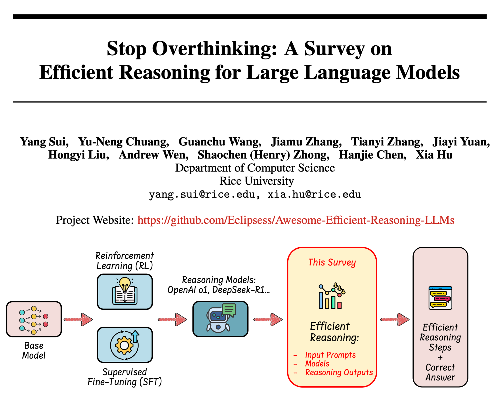

# Awesome-Efficient-Reasoning-LLM

[](https://arxiv.org/abs/2503.16419)
<!-- []() <!-- Optional: Link to GitHub repo -->
<!-- []() <!-- Fill in your repo link -->
<!-- []() --> 

<!-- omit in toc -->
## 📢 News
- **March 2025**: We released our survey paper "[Stop Overthinking: A Survey on Efficient Reasoning for Large Language Models](https://arxiv.org/abs/2503.16419)".  
  Feel free to cite, contribute, or open a pull request to add recent related papers!

<!-- omit in toc -->
## 👀 Introduction


# Stop Overthinking: A Survey on Efficient Reasoning for Large Language Models


Welcome to the official repository for our survey paper:  
**_Stop Overthinking: A Survey on Efficient Reasoning for Large Language Models_**

Here, you'll find resources, updates, and supplementary materials related to our work.

In this paper, we present the first structured survey that systematically investigates and organizes the current progress in achieving **efficient reasoning in LLMs**.

## 📊 Taxonomy

Below is a taxonomy graph summarizing the current landscape of efficient reasoning research for LLMs:


## 🔍 Key Directions

We categorize existing research into the following key directions:

1. **Model-based Efficient Reasoning**  
   Techniques that optimize full-length reasoning models into more concise variants, or directly train models for efficient reasoning.

2. **Reasoning Output-based Efficient Reasoning**  
   Methods that reduce reasoning steps and output length dynamically during inference.

3. **Input Prompt-based Efficient Reasoning**  
   Approaches that enhance reasoning efficiency through tailored prompt design or manipulation.

## 📌 Additional Topics

- The role of **efficient data** in training reasoning-capable models  
- The reasoning potential of **small language models**  
- **Evaluation methods and benchmarks** for assessing reasoning efficiency

---

For a detailed overview, please refer to the [full paper](https://arxiv.org/abs/2503.16419).


<!-- omit in toc -->
## 📚 Table of Contents

- [Awesome-Efficient-Reasoning-LLM](#awesome-efficient-reasoning-llm)
  - [Section I: RL with Length Reward Design](#section-i-rl-with-length-reward-design)
  - [Section II: SFT with Variable-Length CoT Data](#section-ii-sft-with-variable-length-cot-data)
  - [Section III: Compressing Reasoning Steps into Fewer Latent Representation](#section-iii-compressing-reasoning-steps-into-fewer-latent-representation)
  - [Section IV: Dynamic Reasoning Paradigm during Inference](#section-iv-dynamic-reasoning-paradigm-during-inference)
  - [Section V: Prompt-Guided Efficient Reasoning](#section-v-prompt-guided-efficient-reasoning)
  - [Section VI: Prompts Attribute-Driven Reasoning Routing](#section-vi-prompts-attribute-driven-reasoning-routing)
  - [Section VII: Reasoning Abilities via Efficient Training Data and Model Compression](#section-vii-reasoning-abilities-via-efficient-training-data-and-model-compression)
  - [Section VIII: Evaluation and Benchmark](#section-viii-evaluation-and-benchmark)
  - [Citation](#citation)


---

<!--[[Paper]](pdf LINK) -->

## Section I:  RL with Length Reward Design

* Demystifying Long Chain-of-Thought Reasoning in LLMs [[Paper]](https://arxiv.org/pdf/2502.03373) 
* O1-Pruner: Length-Harmonizing Fine-Tuning for O1-Like Reasoning Pruning [[Paper]](https://arxiv.org/pdf/2501.12570) 
* Kimi k1.5: Scaling Reinforcement Learning with LLMs [[Paper]](https://arxiv.org/pdf/2501.12599) 
* Training Language Models to Reason Efficiently [[Paper]](https://arxiv.org/pdf/2502.04463) 
* L1: Controlling How Long A Reasoning Model Thinks With Reinforcement Learning [[Paper]](https://www.arxiv.org/pdf/2503.04697) 
* DAST: Difficulty-Adaptive Slow-Thinking for Large Reasoning Models [[Paper]](https://arxiv.org/pdf/2503.04472) 
* Optimizing Test-Time Compute via Meta Reinforcement Fine-Tuning [[Paper]](https://arxiv.org/pdf/2503.07572) 

## Section II: SFT with Variable-Length CoT Data

* TokenSkip: Controllable Chain-of-Thought Compression in LLMs [[Paper]](https://arxiv.org/pdf/2502.12067) 
* C3oT: Generating Shorter Chain-of-Thought without Compromising Effectiveness [[Paper]](https://arxiv.org/pdf/2412.11664) 
* CoT-Valve: Length-Compressible Chain-of-Thought Tuning [[Paper]](https://arxiv.org/pdf/2502.09601) 
* Self-Training Elicits Concise Reasoning in Large Language Models [[Paper]](https://arxiv.org/pdf/2502.20122) 
* Distilling System 2 into System 1 [[Paper]](https://arxiv.org/pdf/2407.06023) 
* Can Language Models Learn to Skip Steps? [[Paper]](https://arxiv.org/pdf/2411.01855) 
* Stepwise Perplexity-Guided Refinement for Efficient Chain-of-Thought Reasoning in Large Language Models [[Paper]](https://arxiv.org/pdf/2502.13260) 

## Section III: Compressing Reasoning Steps into Fewer Latent Representation

* Training Large Language Models to Reason in a Continuous Latent Space [[Paper]](https://arxiv.org/pdf/2412.06769) 
* Compressed Chain of Thought: Efficient Reasoning through Dense Representations [[Paper]](https://arxiv.org/pdf/2412.13171) 
* Efficient Reasoning with Hidden Thinking (MLLM) [[Paper]](https://arxiv.org/pdf/2501.19201) 
* SoftCoT: Soft Chain-of-Thought for Efficient Reasoning with LLMs [[Paper]](https://arxiv.org/pdf/2502.12134) 
* Token Assorted: Mixing Latent and Text Tokens for Improved Language Model Reasoning [[Paper]](https://arxiv.org/pdf/2502.03275) 
* Reasoning with Latent Thoughts: On the Power of Looped Transformers [[Paper]](https://arxiv.org/pdf/2502.17416) 
* CODI: Compressing Chain-of-Thought into Continuous Space via Self-Distillation [[Paper]](https://arxiv.org/pdf/2502.21074) 

## Section IV: Dynamic Reasoning Paradigm during Inference

* Efficiently Serving LLM Reasoning Programs with Certaindex [[Paper]](https://arxiv.org/pdf/2412.20993) 
* When More is Less: Understanding Chain-of-Thought Length in LLMs [[Paper]](https://arxiv.org/pdf/2502.07266) 
* Sketch-of-Thought: Efficient LLM Reasoning with Adaptive Cognitive-Inspired Sketching [[Paper]](https://arxiv.org/pdf/2503.05179) 
* Reward-Guided Speculative Decoding for Efficient LLM Reasoning [[Paper]](https://arxiv.org/pdf/2501.19324) 
* Fast Best-of-N Decoding via Speculative Rejection [[Paper]](https://arxiv.org/pdf/2410.20290) 
* FastMCTS: A Simple Sampling Strategy for Data Synthesis [[Paper]](https://www.arxiv.org/pdf/2502.11476) 
* Dynamic Parallel Tree Search for Efficient LLM Reasoning [[Paper]](https://arxiv.org/pdf/2502.16235) 
* Sampling-Efficient Test-Time Scaling: Self-Estimating the Best-of-N Sampling in Early Decoding [[Paper]](https://arxiv.org/pdf/2503.01422) 
* LightThinker: Thinking Step-by-Step Compression (training LLMs to compress thoughts into gist tokens) [[Paper]](https://arxiv.org/pdf/2502.15589) 
* InftyThink: Breaking the Length Limits of Long-Context Reasoning in Large Language Models [[Paper]](https://www.arxiv.org/pdf/2503.06692) 
  
## Section V: Prompt-Guided Efficient Reasoning

* Token-Budget-Aware LLM Reasoning [[Paper]](https://arxiv.org/pdf/2412.18547) 
* Chain of Draft: Thinking Faster by Writing Less [[Paper]](https://arxiv.org/pdf/2502.18600) 
* How Well do LLMs Compress Their Own Chain-of-Thought? A Token Complexity Approach [[Paper]](https://arxiv.org/pdf/2503.01141) 
* The Benefits of a Concise Chain of Thought on Problem-Solving in Large Language Models [[Paper]](https://arxiv.org/pdf/2401.05618) 

## Section VI: Prompts Attribute-Driven Reasoning Routing
* Claude 3.7 Sonnet and Claude Code [[website]](https://www.anthropic.com/news/claude-3-7-sonnet) 
* Sketch-of-Thought: Efficient LLM Reasoning with Adaptive Cognitive-Inspired Sketching [[Paper]](https://arxiv.org/pdf/2503.05179) 
* Learning to Route LLMs with Confidence Tokens [[Paper]](https://arxiv.org/pdf/2410.13284) 
* Confident or Seek Stronger: Exploring Uncertainty-Based On-device LLM Routing From Benchmarking to Generalization [[Paper]](https://arxiv.org/pdf/2502.04428) 
* RouteLLM: Learning to Route LLMs with Preference Data [[Paper]](https://arxiv.org/pdf/2406.18665) 

## Section VII: Reasoning Abilities via Efficient Training Data and Model Compression

* LIMO: Less is More for Reasoning [[Paper]](https://arxiv.org/pdf/2502.03387) 
* s1: Simple test-time scaling [[Paper]](https://arxiv.org/pdf/2501.19393) 
* S2R: Teaching LLMs to Self-verify and Self-correct via Reinforcement Learning [[Paper]](https://arxiv.org/pdf/2502.12853) 
* Light-R1: Curriculum SFT, DPO and RL for Long COT from Scratch and Beyond [[Paper]](https://arxiv.org/pdf/2503.10460) 
* Small Models Struggle to Learn from Strong Reasoners [[Paper]](https://arxiv.org/pdf/2502.12143) 
* Towards Reasoning Ability of Small Language Models [[Paper]](https://arxiv.org/pdf/2502.11569) 
* Mixed Distillation Helps Smaller Language Models Reason Better [[Paper]](https://arxiv.org/pdf/2312.10730) 
* Small language models need strong verifiers to self-correct reasoning [[Paper]](https://arxiv.org/pdf/2404.17140) 
* Teaching Small Language Models Reasoning through Counterfactual Distillation [[Paper]](https://aclanthology.org/2024.emnlp-main.333.pdf) 
* Improving Mathematical Reasoning Capabilities of Small Language Models via Feedback-Driven Distillation [[Paper]](https://arxiv.org/pdf/2411.14698) 
* Probe then retrieve and reason: Distilling probing and reasoning capabilities into smaller language models [[Paper]](https://aclanthology.org/2024.lrec-main.1140.pdf) 
* Distilling Reasoning Ability from Large Language Models with Adaptive Thinking [[Paper]](https://arxiv.org/pdf/2404.09170) 
* SKIntern: Internalizing Symbolic Knowledge for Distilling Better CoT Capabilities into Small Language Models [[Paper]](https://arxiv.org/pdf/2409.13183) 
  
## Section VIII: Evaluation and Benchmark
* Can 1B LLM Surpass 405B LLM? Rethinking Compute-Optimal Test-Time Scaling [[Paper]](https://arxiv.org/pdf/2502.06703) 
* The Danger of Overthinking: Examining the Reasoning-Action Dilemma in Agentic Tasks [[Paper]](https://arxiv.org/pdf/2502.08235) 
* Inference-Time Computations for LLM Reasoning and Planning: A Benchmark and Insights [[Paper]](https://arxiv.org/pdf/2502.12521) 


## Citation
If you find this work useful, welcome to cite us.
```bib
@misc{sui2025stopoverthinkingsurveyefficient,
      title={Stop Overthinking: A Survey on Efficient Reasoning for Large Language Models}, 
      author={Yang Sui and Yu-Neng Chuang and Guanchu Wang and Jiamu Zhang and Tianyi Zhang and Jiayi Yuan and Hongyi Liu and Andrew Wen and Shaochen and Zhong and Hanjie Chen and Xia Hu},
      year={2025},
      eprint={2503.16419},
      archivePrefix={arXiv},
      primaryClass={cs.CL},
      url={https://arxiv.org/abs/2503.16419}, 
}
```

## Acknowledgment
> 🧩 *Layout inspired by [zzli2022/Awesome-System2-Reasoning-LLM](https://github.com/zzli2022/Awesome-System2-Reasoning-LLM). Many thanks for the great structure!*
